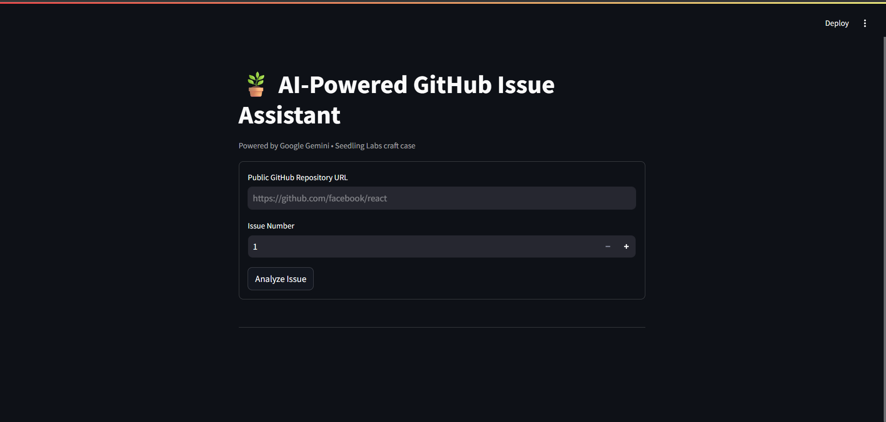
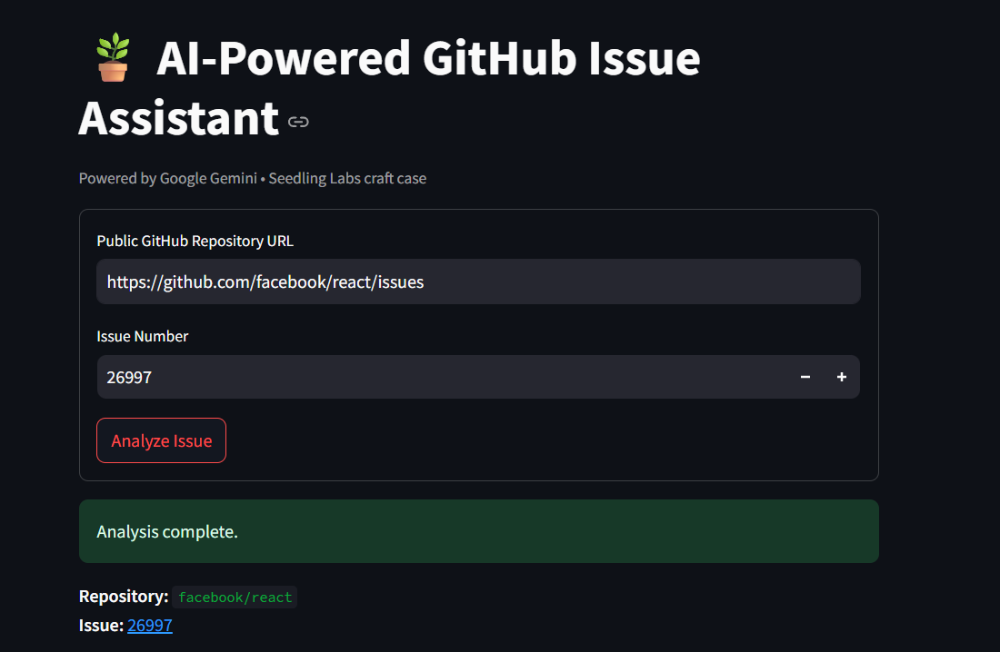
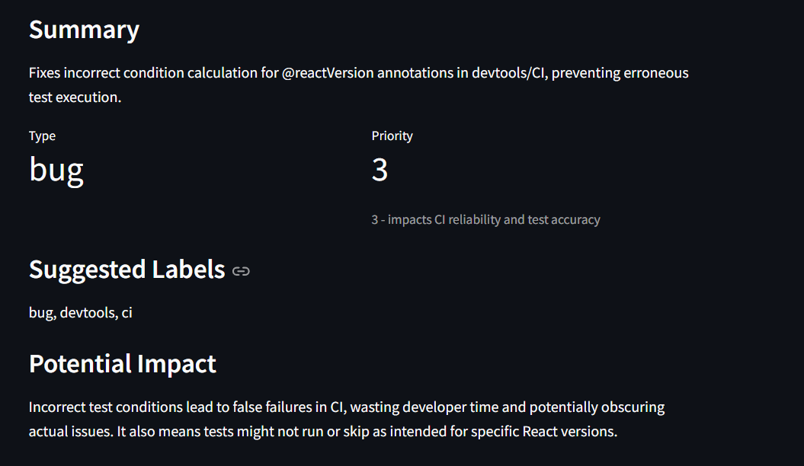
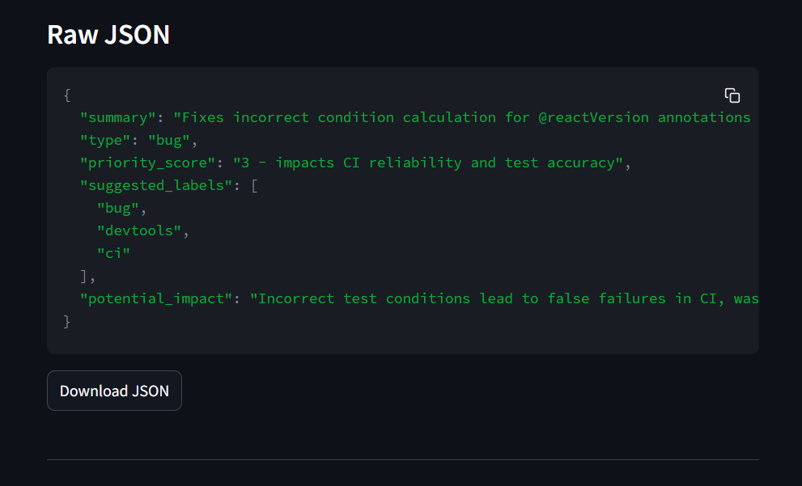

<p align="center">
  </p>

# 🪴 AI-Powered GitHub Issue Assistant

An intelligent tool that reads any **GitHub issue** and automatically classifies it into a structured JSON summary — identifying the issue **type**, **priority**, **labels**, and **potential impact** — using **Google’s Gemini API** and **live GitHub data**.

> 🎯 **Built for the Seedling Labs Engineering Craft Case**
> Focus: AI-assisted problem solving, clean system design, and thoughtful engineering.

---

## 🌍 Table of Contents
1. [Overview](#-overview)
2. [Architecture](#-architecture)
3. [Prompt Engineering Strategy](#-prompt-engineering-strategy)
4. [Edge Cases Handled](#-edge-cases-handled)
5. [Setup & Installation](#️-setup--installation)
6. [Running the App](#-running-the-app)
7. [Usage Demo](#-usage-demo)
8. [Performance & Speed](#-performance--speed)


---

## 🧠 Overview

The **AI-Powered GitHub Issue Assistant** analyzes issues directly from any public GitHub repository and produces a compact, well-structured JSON output.

Each analysis includes:
```json
{
  "summary": "Short plain-English summary",
  "type": "bug | feature_request | documentation | question | other",
  "priority_score": "N - brief justification",
  "suggested_labels": ["label1", "label2"],
  "potential_impact": "Concise impact statement"
}
```
### 🤖 AI GitHub Issue Assistant
Overview

This project uses:

FastAPI — for an asynchronous backend

httpx — for GitHub API calls

Google Gemini — for structured summarization

Streamlit — for a clean, interactive frontend

## 🧩 Architecture
<p align="center">  </p>

#✅ Tech Stack

| Category | Technology |
| :--- | :--- |
| **Language** | Python 3.11 |
| **Backend** | FastAPI + httpx + Pydantic |
| **Frontend** | Streamlit |
| **AI Model** | Google Gemini 1.5 |
| **Hosting Ready** | Hugging Face / Render / Deta |

## 🎯 Prompt Engineering Strategy

* **Strict Schema Enforcement** — Gemini outputs JSON only, validated with Pydantic
* **Multi-shot Few-Shot Prompting** — 4 examples (Bug, Feature, Docs, Question)
* **Repair Prompting** — Automatically retries malformed JSON
* **Contextual Guidance** — Explicit field definitions + multilingual support
* **Truncation** — Large issue bodies/comments are trimmed for faster inference
## ⚙️ Edge Cases Handled

| Edge Case | Behavior |
| :--- | :--- |
| ❌ Invalid repo URL | Returns `400` with clear message |
| 🔒 Private repo | `403` with token hint |
| 🚫 Issues disabled | Graceful error message |
| ❓ No comments/body | Conservative JSON generation |
| 📄 Long text | Truncated for efficiency |
| 🌐 Non-English issues | Translated automatically |
| ⏳ API rate limit | Warns to add `GITHUB_TOKEN` |
| ⚙️ Invalid model | Falls back with descriptive error |

## 🧰 Setup & Installation

### Prerequisites
* Python 3.11+
* Google AI Studio API Key (`AIza...`)
* Optional: GitHub Token (to increase rate limit)

### 1️⃣ Clone & Create Virtual Environment
```bash
git clone [https://github.com/](https://github.com/)<your-username>/ai-github-issue-assistant.git
cd ai-github-issue-assistant
python -m venv venv
venv\Scripts\activate  # or source venv/bin/activate
```
### 2️⃣ Install Dependencies
```bash
pip install -r requirements.txt
```
### 3️⃣ Configure Environment
Create file: backend/.env
```bash
GOOGLE_API_KEY=AIza...your_key_here
GITHUB_TOKEN=ghp_...optional_token
MODEL_NAME=models/gemini-1.5-flash-latest
```

## 🏃 Running the App
### ▶ Backend
```bash
cd backend
uvicorn main:app --host 0.0.0.0 --port 8000 --reload
```
### ▶ Frontend
```bash
cd ../frontend
streamlit run streamlit_app.py
```
### URLs:

Backend: http://127.0.0.1:8000/docs

Frontend: http://localhost:8501

## 💡 Usage Demo
<p align="center">
  
  
  
  
</p>


1. **Enter a repo URL** — e.g. `https://github.com/facebook/react`
2. **Enter an issue number** — e.g. `27000`
3. Click **Analyze Issue**

### You'll See:
The tool generates a structured analysis including:

* 📝 **Summary**
* 🏷️ **Type**
* 🚦 **Priority**
* 🏷️ **Suggested Labels**
* 👾 **Potential Impact**
* 💾 **Downloadable JSON Output**

## ⚙️ Performance & Speed

| Optimization | Description |
| :--- | :--- |
| ⚡ **Async I/O** | Parallel GitHub + Gemini calls |
| 🧮 **Token control** | Truncates large issue text |
| 🧠 **Few-shot prompting** | Improves classification consistency |
| 🩺 **Health check route** | Monitors uptime |
| ⏱️ **Latency logging** | Tracks response times |

> ⏰ **Average runtime:** ~3–4 seconds per issue (Gemini Flash)
